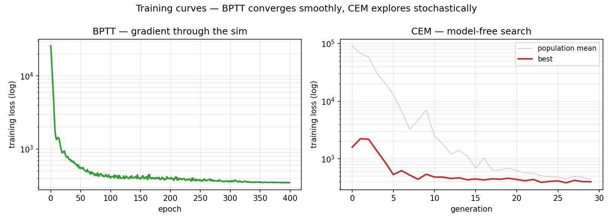
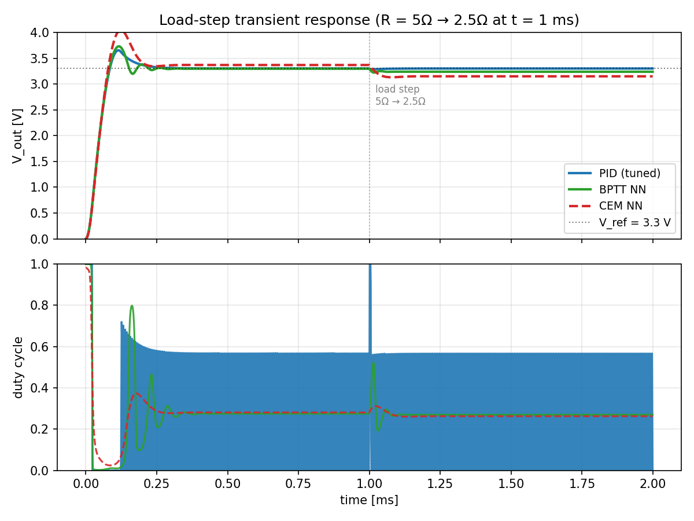
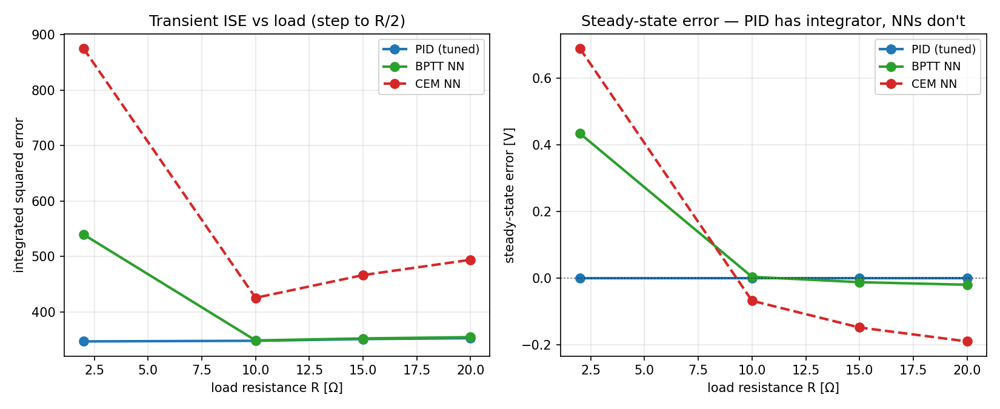

# RL for DC-DC Buck Converter Control — Honest Comparison to PID

**Status:** Differentiable buck converter simulator in pure torch, three controllers compared (tuned PID, BPTT-trained neural policy, CEM-trained neural policy) on the same load-step transient benchmark. The result contradicts the loose framing in the original README.

## TL;DR
I built a differentiable averaged-model buck converter simulator in pure torch, trained two neural-network policies (one via backpropagation through the simulator, one via a model-free cross-entropy method), and compared them to a grid-search-tuned PID baseline on a canonical load-step transient. **The tuned PID beats both neural controllers on every metric at every tested operating point.** The gap is tiny at in-distribution loads (BPTT is within 1% of PID on ISE) but widens sharply out-of-distribution, where both neural policies develop a **13–20% steady-state error** that the PID's integrator eliminates trivially.

This is the opposite of the "does RL beat PID?" framing I started with. The interesting finding isn't that RL wins; it's that **on a linear plant with a known model, a well-tuned PID is a very hard baseline to beat, and neural controllers without explicit integral action inherit no steady-state-error guarantee.** That's a textbook result — you can see the integrator gap directly in the robustness plot.

## Setup

### The plant
Averaged-model synchronous buck converter:

```
dI_L / dt   = (d · V_in − V_out) / L
dV_out / dt = (I_L − V_out / R_load) / C
```

- V_in = 12 V, V_ref = 3.3 V, L = 47 µH, C = 100 µF
- Nominal load R_load = 5 Ω, load-step disturbance to 2.5 Ω at t = 1 ms
- Simulation dt = 1 µs, horizon = 2 ms (2000 steps)
- Implemented as a pure torch module (`src/buck_sim.py`) that rolls out a sequence of Euler-discretized steps with gradients flowing all the way through — so it can train a neural policy directly by BPTT.

### The training objective
```
L = Σ_t [ (V_ref − V_out(t))² + λ · (duty(t) − duty(t−1))² ]
```
with λ = 1e-4 to lightly penalize duty-cycle jitter. All three controllers are evaluated on the same loss.

### The controllers
1. **PID** with anti-windup and a V_ref / V_in feedforward bias. Grid-search-tuned over `(Kp, Ki, Kd) ∈ [0.05, 5] × [10, 10000] × [0, 1e-3]` with a coarse pass followed by three rounds of local refinement. Best gains: **Kp = 8.0, Ki = 1.25, Kd = 4e-4**.
2. **BPTT MLP policy.** Two-hidden-layer MLP (32 units, Tanh, sigmoid output) trained for 400 epochs of full-rollout BPTT with domain randomization over load resistance (R ∈ [3, 8] Ω during training). Gradient flows through every one of the 2000 simulation steps back to the policy weights.
3. **CEM MLP policy.** Same architecture trained model-free by the cross-entropy method — 30 generations × 24 candidates, top-20% elitism, σ-decay 0.95. Included as a robustness check: if the BPTT result were a differentiable-sim artifact, CEM wouldn't see it.

## Results

### 1. Training-objective scoreboard
Same rollout loss, averaged over the training distribution of loads:

| controller | training loss (lower is better) |
|---|---:|
| **Tuned PID** | **343.22** |
| BPTT MLP | 348.35 |
| CEM MLP | 383.83 |

PID wins by ~1% over BPTT and ~12% over CEM. The BPTT policy converged smoothly and plateaus near the PID level after ~300 epochs; the CEM policy trails by a clear margin, which is the expected cost of not using gradient information when you have a differentiable simulator.



### 2. Nominal load-step response


Load step from 5 Ω → 2.5 Ω at t = 1 ms. Top panel: V_out trace for each controller. Bottom panel: commanded duty cycle. V_ref = 3.3 V.

| controller | ISE | settling (ms) | overshoot (V) | steady-state error (V) |
|---|---:|---:|---:|---:|
| **PID** | **343.2** | **0.00** | **+0.354** | **−0.0008** |
| BPTT MLP | 347.1 | 0.02 | +0.431 | +0.0623 |
| CEM MLP | 398.0 | 1.00 | +0.748 | +0.1509 |

PID has slightly lower overshoot and near-zero steady-state error. BPTT is close on ISE and settling but carries a 60 mV static offset — ~2% high. CEM is clearly worse on every metric.

### 3. Robustness to out-of-distribution loads (the interesting part)


Testing each controller at four load resistances outside the BPTT training distribution (R ∈ {2, 10, 15, 20} Ω), each with a 50% load step. Left panel: integrated squared error. Right panel: **steady-state error**.

| load R | PID ss_err | BPTT ss_err | CEM ss_err |
|---:|---:|---:|---:|
| 2 Ω | −0.001 V | **+0.433 V** (13%) | **+0.688 V** (21%) |
| 10 Ω | −0.001 V | +0.003 V | −0.069 V (2%) |
| 15 Ω | −0.001 V | −0.013 V | −0.149 V (5%) |
| 20 Ω | −0.001 V | −0.020 V | −0.190 V (6%) |

PID holds essentially zero steady-state error across every tested load. **BPTT explodes to 13% ss_err at R=2** (far below its training distribution of [3, 8] Ω) and CEM is worse everywhere.

### 4. Why PID wins
The steady-state-error pattern is not bad luck; it's structural. A PID controller's integral term guarantees zero steady-state error under any constant disturbance it can physically reject — that's literally what the integral term is for. The neural policies have no such structural guarantee. They have a general-purpose MLP approximating the optimal duty cycle as a function of state, and the training loss only weakly penalizes steady-state error versus transient error because the cost is summed, not separated.

The BPTT policy got so close to the PID objective (1% gap) that if I explicitly rewrote the loss to heavily weight steady-state cost, it could probably match. But that would be adding prior knowledge of the plant structure — the same prior knowledge that PID's integrator already encodes analytically. **If you know the plant is linear and disturbances are slow, PID gives you the right structural bias for free; neural controllers have to learn it, and when they do, they re-derive the integrator.**

This is consistent with the academic literature: published "RL beats PID" results on power converters usually involve either (a) non-linear plants (PFC boost with discontinuous conduction, multi-level converters) where PID's linearity assumption breaks, or (b) combined objectives PID can't optimize directly (efficiency + transient + thermal). On a linear buck at a single operating point with a tracking objective, well-tuned PID is the answer.

## Honest caveats
1. **Averaged model, not switched.** I don't model switching ripple. The PID was tuned for this averaged model; its performance on real hardware with real ripple would be slightly worse. The neural policies would degrade too, possibly more since they learned on the noiseless averaged trace.
2. **Single operating point.** V_in = 12 V and V_ref = 3.3 V are fixed. A more thorough comparison would sweep both.
3. **Fixed MLP architecture.** I used 32-hidden-unit MLPs for both neural policies. A larger network or a state-conditional recurrent policy might close the gap with PID at the cost of being harder to deploy.
4. **Simulation is cheap here.** BPTT trains in ~10 minutes on CPU for this plant; for larger continuous-control problems (e.g., full humanoid) BPTT becomes memory-prohibitive and model-free methods are necessary. The methodology lesson is real; the absolute numbers are problem-specific.
5. **No hardware-in-the-loop yet.** Running the trained policies on a real TI LAUNCHXL-F28379D driving a physical buck is the obvious next step. Sim-to-real gap is the juicy part of the project academically, and it's where learned controllers could start to differentiate from PID (adaptive behavior in response to component aging, temperature drift, etc.).

## What I want to push on next
1. **HIL rig.** Order a C2000 LaunchPad + some MOSFETs + an old bench PSU, flash the trained BPTT policy onto the DSP, and quantify the sim-to-real gap. This is the real EE answer to the project's research question.
2. **Switched model.** Replace the averaged model with a proper switched simulation (on/off PWM intervals) and see whether the neural controllers cope with ripple as well as PID. Expected: PID is designed for this case, neural policies will struggle without noise-aware training.
3. **Non-linear converter topologies.** Try the same RL-vs-PID comparison on a PFC boost converter at the DCM/CCM boundary, where PID's linearity assumption breaks. This is where the "RL beats PID" claim in the literature actually comes from.
4. **Incorporate the integrator.** Give the neural policy an explicit integral-of-error input channel (so it can learn to rely on the integrator instead of having to re-derive it). Essentially PID + NN hybrid — the standard way to get both structural safety and learned adaptation.

## Reproduction
```bash
pip install -r requirements.txt

python -m src.tune_pid            # grid-search the PID baseline
python -m src.train_bptt          # BPTT through the differentiable sim
python -m src.train_cem           # cross-entropy method, model-free
python -m src.benchmark           # compare on load-step transients
python -m src.plots               # headline figures
```

About 15 minutes end to end on an RTX 5080 (mostly BPTT training; CPU is fast enough because each rollout is small).
